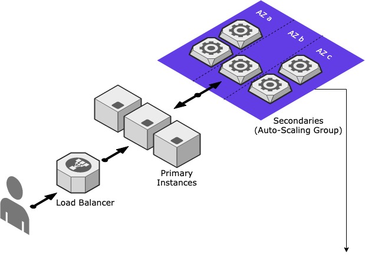
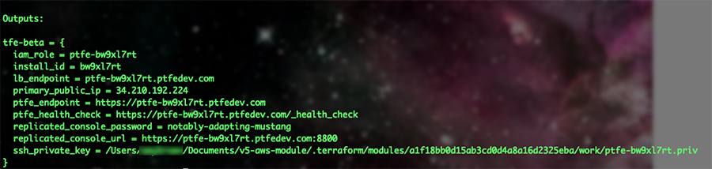

# Terraform Enterprise HA (Beta) Example

This example assumes you have already set up your gcp project with the required prereqs:

	* VPC
	* Subnets (both public and private) spread across multiple AZs
	* A DNS Zone
	* A Certificate available in ACM for the hostname provided (or a wildcard certificate for the domain)
	* A license file provided by your Technical Account Manager

With this code you can either create a single instance, or a build a cluster:



## Change to the example directory

```
cd examples/root-example
```

## Install Terraform

Install Terraform if it is not already installed (visit [terraform.io](https://terraform.io) for other distributions):

```
../terraform-install.sh
```

## Set the desired options in the module block

You'll need to update the following settings to your set up:

	* vpc_id: VPC to use
	* domain: The domain setup in Route53
	* license_file: License file provided by your TAM or SE
	* secondary_count: Number of worker instances to create
	* primary_count: Number of primaries to create
	* distribution: OS Distribution to use - ubuntu or rhel

 This example is set to spin up 3 primaries and 3 secondaries.   

## Run Terraform
```
terraform init
terraform apply
```

## Wait for the application to load

The replicated console url will output along with the password. 



You can log into that dashboard at that url and wait for the application to be ready. This can take up to 30 minutes! Once complete use the `Open` link to set up the admin user and initial organization. 

